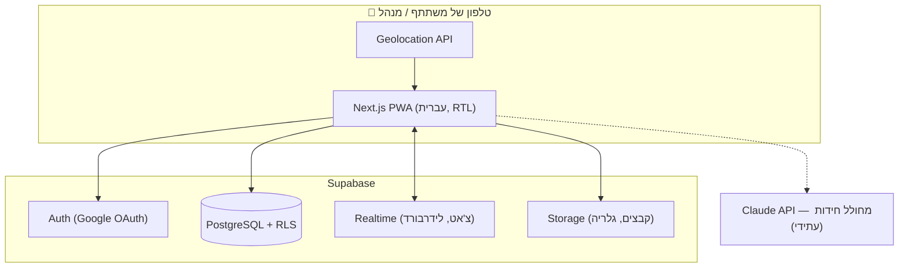

# 02 — ארכיטקטורה וטכנולוגיות

## 1. הסטאק המומלץ

| שכבה | בחירה | נימוק |
|---|---|---|
| Frontend | **Next.js (React) + TypeScript** | אתר Mobile-First מהיר, PWA, אקוסיסטם ענק |
| עיצוב | **Tailwind CSS** עם `dir="rtl"` | תמיכת RTL מובנית (logical properties), פיתוח מהיר |
| Backend / DB | **Supabase** (PostgreSQL) | Auth עם Google, Realtime, Storage ו-RLS — הכל בחבילה אחת, ללא שרת לתחזק |
| התחברות | Supabase Auth — **Google OAuth** | דרישה מפורשת; אפס ניהול סיסמאות |
| זמן אמת | **Supabase Realtime** | צ'אט, טבלת מובילים חיה, סטטוס בקשות הצטרפות |
| קבצים | **Supabase Storage** | קבצי צ'אט, גלריה, תמונות משימות |
| מפות | **Leaflet + OpenStreetMap** (או Google Maps) | תצוגת תחנות למנהל; חינמי |
| מיקום | **Browser Geolocation API** | `watchPosition` + חישוב מרחק (Haversine) מול רדיוס התחנה |
| אירוח | **Vercel** (חינם) + Supabase (חינם) | עלות 0₪ לשימוש של פעם בשנה עם 40 משתמשים |
| AI (עתידי) | **Claude API** | מחולל חידות מבוסס דוגמאות עבר |

**חלופה שנשקלה:** Firebase (Auth + Firestore + Storage) — לגיטימית לחלוטין.
Supabase נבחר בזכות SQL אמיתי (שאילתות דירוג וחלוקה לקבוצות פשוטות יותר)
ו-Row Level Security שממפה בצורה טבעית את מודל ההרשאות "מנהל תורן רק על המירוץ שלו".

## 2. תרשים ארכיטקטורה

## 3. החלטות מרכזיות

### 3.1 נעילת משימה לפי מיקום (Geofencing)

- לכל תחנה: `lat`, `lng`, `radius_m` (ברירת מחדל 75 מ׳, ניתן לכיוון פר-תחנה)
- הקליינט מריץ `watchPosition`; כשהמרחק (Haversine) ≤ רדיוס — נשלחת בקשת "הגעה"
  לשרת **כולל הקואורדינטות**, והשרת מאמת שוב את המרחק לפני פתיחת המשימה
  (לא סומכים על הקליינט בלבד)
- מתחשבים ב-GPS accuracy: אם דיוק המדידה גרוע, מרחיבים את הסף בהתאם
- למנהל יש כפתור "פתח ידנית" למקרה של בעיות קליטה (עדיף חוויה טובה על אכיפה מושלמת)

### 3.2 מצב משימה נוכחית לקבוצה

לכל קבוצה יש רצף תחנות מסודר (טבלת `team_stations` עם `position`).
המשימה הנוכחית = התחנה הראשונה שלא הושלמה.
כל חברי הקבוצה רואים אותו מצב — הוא נגזר מהשרת, לא נשמר בקליינט.

### 3.3 טבלת מובילים בלי לחשוף התקדמות

השאילתה מחזירה רק **סדר דירוג** (מקום 1, 2, 3...) לפי:
`מספר משימות שהושלמו DESC, זמן השלמה אחרון ASC` —
בלי לחשוף כמה משימות הושלמו ומתוך כמה. עדכון חי דרך Realtime.

### 3.4 הרשאות (RLS)

- `race_admins(race_id, user_id)` — מנהל תורן משויך למירוץ ספציפי
- מדיניות RLS: כתיבה על מירוץ/תחנות/קבוצות מותרת רק אם המשתמש ב-`race_admins`
  של אותו מירוץ **וגם** המירוץ לא בסטטוס `archived`
- בסיום מירוץ הוא עובר ל-`archived` — נעול לעריכה לכולם, פתוח לקריאה (היכל התהילה)
- תוכן קבוצה (צ'אט, משימה נוכחית) נגיש רק לחברי קבוצה **מאושרים** ולמנהלי המירוץ

### 3.5 קודים

- **קוד משחק:** 6 תווים אקראיים ידידותיים (בלי אותיות מבלבלות), נוצר עם המשחק
- **קוד קבוצה:** ספרה-שתיים (1–99), ייחודי בתוך המשחק
- זרימה: קוד משחק ← קוד קבוצה ← בקשה ב"המתנה" ← אישור מנהל ← כניסה

### 3.6 חלוקה אוטומטית לקבוצות (איזון גיל ויכולת)

1. לכל משתתף (רשום או ידני): שנת לידה + דירוג יכולת 1–5 (הערכה גסה של המנהל)
2. מחשבים ציון כוח: שקלול גיל (עקומה — שיא בגילאי 15–40, נמוך בקצוות) + יכולת
3. ממיינים לפי ציון ומחלקים ב-**Snake Draft** (1..N ואז N..1) למספר הקבוצות שנבחר
4. תיקון עדין: החלפות זוגיות שמקטינות את פער הממוצעים בין קבוצות
5. התוצאה מוצגת כטיוטה — המנהל גורר ומתקן ידנית לפני אישור

### 3.7 צ'אט קבוצתי

- טבלת `messages` + Supabase Realtime (INSERT subscription)
- קבצים מכל סוג נשמרים ב-Storage בתיקיית הקבוצה, ההודעה מפנה אליהם
- המנהל התורן חבר אוטומטית בכל הצ'אטים של המירוץ שלו
- שיחה קולית (עתידי): WebRTC דרך שירות כמו LiveKit — לא ב-MVP

### 3.8 אזכורים (@) והתראות In-App

**אזכור:** הקלדת `@` פותחת בורר (חברי הקבוצה הרשומים + מנהלי המירוץ).
הבורר מכניס טוקן להודעה, וההודעה נשמרת עם `mentioned_user_ids` —
לא מסתמכים על ניתוח טקסט חופשי בשרת.

**יצירת ההתראה — בצד השרת, לא בקליינט:**
טריגר DB על INSERT ל-`messages` יוצר שורת `notifications` לכל מאוזכר.
כך יש מקור אמת אחד: ההתראה נוצרת תמיד, גם אם הקליינט של השולח נסגר,
ואי אפשר לזייף התראות למשתמשים אחרים.

**הצגה — שלוש שכבות, מהצפה מינימלית למקסימלית:**

| שכבה | איפה | מתי |
|---|---|---|
| באנר קופץ (toast) | קומפוננטה גלובלית ב-layout — מעל **כל** מסך | ברגע האזכור, אם המשתמש מחובר; נעלם אחרי ~5 שניות |
| באדג' `@` | על כפתור הצ'אט במסך הקבוצה | עד שההתראה נקראת (`read_at`) |
| רשימת "מה פספסתי" | פתיחת הצ'אט מגלגלת להודעה הראשונה שלא נקראה ומדגישה אזכורים | בכניסה מחדש לאפליקציה |

**למה כך:** במהלך המירוץ המשתתפים נמצאים רוב הזמן במסך "מהלך המשחק",
לא בצ'אט — לכן ההתראה חייבת לצוץ מעל כל מסך (באנר גלובלי) ולא רק בתוך הצ'אט.
באנר לבד נעלם ומתפספס, לכן הבאדג' מתמיד עד קריאה. אין צורך במרכז התראות
מלא בנפרד — בקנה מידה של ~40 משתמשים זה מסך מיותר; הצ'אט עצמו הוא ההקשר.

**מימוש:** הקליינט מנוי ב-Realtime על INSERT ב-`notifications` מסונן לפי
`user_id` שלו; לחיצה על באנר/באדג' מנווטת לצ'אט עם עוגן להודעה ומעדכנת `read_at`.

### 3.9 PWA

מותקנת כאייקון על מסך הבית, מסך מלא, שמירת מצב בסיסית בזמן קליטה חלשה בשטח.
לא נדרש אופליין מלא — המירוץ מחייב רשת לצ'אט וללידרבורד ממילא.
