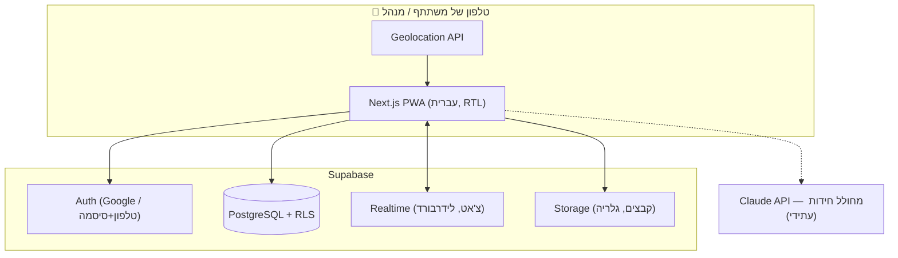

# 02 — ארכיטקטורה וטכנולוגיות

## 1. הסטאק המומלץ

| שכבה | בחירה | נימוק |
|---|---|---|
| Frontend | **Next.js (React) + TypeScript** | אתר Mobile-First מהיר, PWA, אקוסיסטם ענק |
| עיצוב | **Tailwind CSS** עם `dir="rtl"` | תמיכת RTL מובנית (logical properties), פיתוח מהיר |
| Backend / DB | **Supabase** (PostgreSQL) | Auth עם Google, Realtime, Storage ו-RLS — הכל בחבילה אחת, ללא שרת לתחזק |
| התחברות | Supabase Auth — **Google OAuth + טלפון וסיסמה** | Google למי שיש; הרשמה קלילה (טלפון, שם מלא, סיסמה) לכל השאר — בלי אימות SMS, בלי עלות |
| זמן אמת | **Supabase Realtime** | צ'אט, טבלת מובילים חיה, סטטוס בקשות הצטרפות |
| קבצים | **Supabase Storage** | קבצי צ'אט, גלריה, תמונות משימות |
| מפות | **Leaflet + OpenStreetMap** (או Google Maps) | תצוגת תחנות למנהל; חינמי |
| מיקום | **Browser Geolocation API** | `watchPosition` + חישוב מרחק (Haversine) מול רדיוס התחנה |
| אירוח | **Vercel** (חינם) + Supabase (חינם) | עלות 0₪ לשימוש של פעם בשנה עם 40 משתמשים; אתר בלבד — בלי App Store / Google Play, בלי עמלות ובלי תהליכי אישור |
| AI (עתידי) | **Claude API** | מחולל חידות מבוסס דוגמאות עבר |

**חלופה שנשקלה:** Firebase (Auth + Firestore + Storage) — לגיטימית לחלוטין.
Supabase נבחר בזכות SQL אמיתי (שאילתות דירוג וחלוקה לקבוצות פשוטות יותר)
ו-Row Level Security שממפה בצורה טבעית את מודל ההרשאות "מנהל תורן רק על המירוץ שלו".

## 2. תרשים ארכיטקטורה

## 3. החלטות מרכזיות

### 3.1 נעילת משימה לפי מיקום (Geofencing)

- לכל תחנה: `lat`, `lng`, `radius_m` (ברירת מחדל 75 מ׳, ניתן לכיוון פר-תחנה)
- הקליינט מריץ `watchPosition`; כשהמרחק (Haversine) ≤ רדיוס — נשלחת בקשת "הגעה"
  לשרת **כולל הקואורדינטות**, והשרת מאמת שוב את המרחק לפני פתיחת המשימה
  (לא סומכים על הקליינט בלבד)
- מתחשבים ב-GPS accuracy: אם דיוק המדידה גרוע, מרחיבים את הסף בהתאם
- למנהל יש כפתור "פתח ידנית" למקרה של בעיות קליטה (עדיף חוויה טובה על אכיפה מושלמת)

### 3.2 מצב משימה נוכחית לקבוצה

לכל קבוצה יש רצף תחנות מסודר (טבלת `team_stations` עם `position`).
המשימה הנוכחית = התחנה הראשונה שלא הושלמה.
כל חברי הקבוצה רואים אותו מצב — הוא נגזר מהשרת, לא נשמר בקליינט.

### 3.3 טבלת מובילים בלי לחשוף התקדמות

השאילתה מחזירה רק **סדר דירוג** (מקום 1, 2, 3...) לפי:
`מספר משימות שהושלמו DESC, זמן השלמה אחרון ASC` —
בלי לחשוף כמה משימות הושלמו ומתוך כמה. עדכון חי דרך Realtime.

### 3.4 הרשאות (RLS)

- `race_admins(race_id, user_id)` — מנהל תורן משויך למירוץ ספציפי
- מדיניות RLS: כתיבה על מירוץ/תחנות/קבוצות מותרת רק אם המשתמש ב-`race_admins`
  של אותו מירוץ **וגם** המירוץ לא בסטטוס `archived`
- בסיום מירוץ הוא עובר ל-`archived` — נעול לעריכה לכולם, פתוח לקריאה (היכל התהילה)
- תוכן קבוצה (צ'אט, משימה נוכחית) נגיש רק לחברי קבוצה **מאושרים** ולמנהלי המירוץ

### 3.5 קודים

- **קוד משחק:** 6 תווים אקראיים ידידותיים (בלי אותיות מבלבלות), נוצר עם המשחק
- **קוד קבוצה:** ספרה-שתיים (1–99), ייחודי בתוך המשחק
- זרימה: קוד משחק ← קוד קבוצה ← בקשה ב"המתנה" ← אישור מנהל ← כניסה

### 3.6 ניהול משתתפים ושיוך ידני לקבוצות

- טבלת `race_participants` — רשימת משתתפים ברמת המירוץ, עם `team_id` אופציונלי
  (null = "עדיין לא שויך"). שיוך לקבוצה = עדכון `team_id`
- הוספת משתתף: בחירה מתוך רשימת משתמשי האתר (autocomplete על `profiles`,
  שמות המשתמשים הרשומים זמינים למנהל) **או** הקלדת שם חופשית למי שבלי חשבון
- **בחירה מרובה:** סימון כמה משתתפים ברשימה ← "שייך לקבוצה" ← עדכון `team_id`
  לכל המסומנים בפעולה אחת (UPDATE יחיד)
- חלוקה אוטומטית מאוזנת (לפי גיל/יכולת) — **לא ממומשת**; אם תידרש בעתיד,
  המודל הזה תומך בה בקלות (היא רק ממלאת `team_id` אוטומטית)

### 3.7 צ'אט קבוצתי

- טבלת `messages` + Supabase Realtime (INSERT subscription)
- קבצים מכל סוג נשמרים ב-Storage בתיקיית הקבוצה, ההודעה מפנה אליהם
- המנהל התורן חבר אוטומטית בכל הצ'אטים של המירוץ שלו
- שיחה קולית (עתידי): WebRTC דרך שירות כמו LiveKit — לא ב-MVP

### 3.8 PWA

מותקנת כאייקון על מסך הבית, מסך מלא, שמירת מצב בסיסית בזמן קליטה חלשה בשטח.
לא נדרש אופליין מלא — המירוץ מחייב רשת לצ'אט וללידרבורד ממילא.
עונה גם על הדרישה "בלי הורדה מחנות": הכל דרך הדפדפן, ההתקנה אופציונלית.

### 3.9 הרשמה עם טלפון וסיסמה (בלי SMS)

- Supabase Auth תומך ב-sign-up עם טלפון + סיסמה; **מכבים אימות OTP ב-SMS**
  (Confirm phone = off) — כך אין תלות בספק SMS ואין עלות לשימוש של פעם בשנה
- הטלפון משמש כמזהה התחברות בלבד; שם מלא נשמר ב-`profiles` בעת ההרשמה
- נרמול מספר בצד קליינט (05X-XXXXXXX ← E.164) כדי שהתחברות חוזרת תמיד תמצא את החשבון
- הסיכון של מספר לא מאומת זניח — זו אפליקציה משפחתית סגורה, וכניסה לקבוצה
  ממילא דורשת קוד משחק + קוד קבוצה + אישור מנהל

### 3.10 הצגת מרחק לתחנה — הגדרת מנהל

- שדה `show_distance` ברמת המירוץ, ברירת מחדל `true`
- כשהוא כבוי, המשתתפים רואים רק את הרמז/חידה בלי מד המרחק החי
  (ה-geofencing ממשיך לעבוד כרגיל — רק התצוגה מוסתרת)
