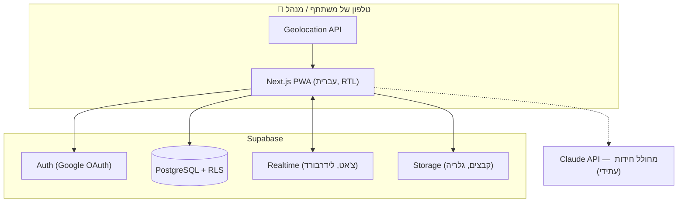

# 02 — ארכיטקטורה וטכנולוגיות

## 1. הסטאק המומלץ

| שכבה | בחירה | נימוק |
|---|---|---|
| Frontend | **Next.js (React) + TypeScript** | אתר Mobile-First מהיר, PWA, אקוסיסטם ענק |
| עיצוב | **Tailwind CSS** עם `dir="rtl"` | תמיכת RTL מובנית (logical properties), פיתוח מהיר |
| Backend / DB | **Supabase** (PostgreSQL) | Auth עם Google, Realtime, Storage ו-RLS — הכל בחבילה אחת, ללא שרת לתחזק |
| התחברות | Supabase Auth — **Google OAuth** | דרישה מפורשת; אפס ניהול סיסמאות |
| זמן אמת | **Supabase Realtime** | צ'אט, טבלת מובילים חיה, סטטוס בקשות הצטרפות |
| קבצים | **Supabase Storage** | קבצי צ'אט, גלריה, תמונות משימות |
| מפות | **Leaflet + OpenStreetMap** (או Google Maps) | תצוגת תחנות למנהל; חינמי |
| מיקום | **Browser Geolocation API** | `watchPosition` + חישוב מרחק (Haversine) מול רדיוס התחנה |
| אירוח | **Vercel** (חינם) + Supabase (חינם) | עלות 0₪ לשימוש של פעם בשנה עם 40 משתמשים |
| AI (עתידי) | **Claude API** | מחולל חידות מבוסס דוגמאות עבר |

**חלופה שנשקלה:** Firebase (Auth + Firestore + Storage) — לגיטימית לחלוטין.
Supabase נבחר בזכות SQL אמיתי (שאילתות דירוג פשוטות יותר)
ו-Row Level Security שממפה בצורה טבעית את מודל ההרשאות "מנהל תורן רק על המירוץ שלו".

## 2. תרשים ארכיטקטורה

```mermaid
flowchart TB
    subgraph Phone["📱 טלפון של משתתף / מנהל"]
        PWA["Next.js PWA (עברית, RTL)"]
        GEO["Geolocation API"]
    end

    subgraph Supabase
        AUTH["Auth (Google OAuth)"]
        DB[("PostgreSQL + RLS")]
        RT["Realtime (צ'אט, לידרבורד)"]
        ST["Storage (קבצים, גלריה)"]
    end

    CLAUDE["Claude API — מחולל חידות (עתידי)"]

    PWA --> AUTH
    PWA --> DB
    PWA <--> RT
    PWA --> ST
    GEO --> PWA
    PWA -.-> CLAUDE
```

## 3. החלטות מרכזיות

### 3.1 נעילת משימה לפי מיקום (Geofencing)

- לכל תחנה: `lat`, `lng`, `radius_m` (ברירת מחדל 75 מ׳, ניתן לכיוון פר-תחנה)
- הקליינט מריץ `watchPosition`; כשהמרחק (Haversine) ≤ רדיוס — נשלחת בקשת "הגעה"
  לשרת **כולל הקואורדינטות**, והשרת מאמת שוב את המרחק לפני פתיחת המשימה
  (לא סומכים על הקליינט בלבד)
- מתחשבים ב-GPS accuracy: אם דיוק המדידה גרוע, מרחיבים את הסף בהתאם
- למנהל יש כפתור "פתח ידנית" למקרה של בעיות קליטה (עדיף חוויה טובה על אכיפה מושלמת)

### 3.2 מצב משימה נוכחית לקבוצה

לכל קבוצה יש רצף תחנות מסודר (טבלת `team_stations` עם `position`).
המשימה הנוכחית = התחנה הראשונה שלא הושלמה.
כל חברי הקבוצה רואים אותו מצב — הוא נגזר מהשרת, לא נשמר בקליינט.

### 3.3 טבלת מובילים בלי לחשוף התקדמות

השאילתה מחזירה רק **סדר דירוג** (מקום 1, 2, 3...) לפי:
`מספר משימות שהושלמו DESC, זמן השלמה אחרון ASC` —
בלי לחשוף כמה משימות הושלמו ומתוך כמה. עדכון חי דרך Realtime.

### 3.4 הרשאות (RLS)

- `race_admins(race_id, user_id)` — מנהל תורן משויך למירוץ ספציפי
- מדיניות RLS: כתיבה על מירוץ/תחנות/קבוצות מותרת רק אם המשתמש ב-`race_admins`
  של אותו מירוץ **וגם** המירוץ לא בסטטוס `archived`
- בסיום מירוץ הוא עובר ל-`archived` — נעול לעריכה לכולם, פתוח לקריאה (היכל התהילה)
- תוכן קבוצה (צ'אט, משימה נוכחית) נגיש רק לחברי קבוצה **מאושרים** ולמנהלי המירוץ

### 3.5 קודים

- **קוד משחק:** 6 תווים אקראיים ידידותיים (בלי אותיות מבלבלות), נוצר עם המשחק
- **קוד קבוצה:** ספרה-שתיים (1–99), ייחודי בתוך המשחק
- זרימה: קוד משחק ← קוד קבוצה ← בקשה ב"המתנה" ← אישור מנהל ← כניסה

### 3.6 חלוקה אוטומטית לקבוצות — **בוטל**

תוכנן אלגוריתם איזון (ציון כוח מגיל ויכולת ← Snake Draft ← החלפות תיקון ←
טיוטה לגרירה ידנית) והוסר מהתוכנית בהחלטה מפורשת.

**למה:** מי משובץ עם מי הוא ההחלטה המשפחתית־רגישה ביותר במירוץ — אחים,
בני זוג, מי ש"חייב" להיות עם סבתא. אלגוריתם שמאזן גיל ויכולת מייצר טיוטה
שבפועל מתקנים אותה ידנית עד שלא נשאר ממנה כלום, ובקנה מידה של ~40 משתתפים
המנהל התורן פשוט מרכיב את הקבוצות בעצמו. ההצטרפות היא ממילא לפי **קוד קבוצה**
(§3.5) — כל אחד מקליד את הקוד של הקבוצה שאליה שובץ.

השדות `birth_year` ו-`ability` נשארים בסכמה (docs/03) כרישום שימושי למנהל,
בלי לוגיקה שנשענת עליהם.

### 3.7 צ'אט קבוצתי

- טבלת `messages` + Supabase Realtime (INSERT subscription)
- קבצים מכל סוג נשמרים ב-Storage בתיקיית הקבוצה, ההודעה מפנה אליהם
- המנהל התורן חבר אוטומטית בכל הצ'אטים של המירוץ שלו
- שיחה קולית (עתידי): WebRTC דרך שירות כמו LiveKit — לא ב-MVP

### 3.8 אזכורים (@) והתראות In-App

**אזכור:** הקלדת `@` פותחת בורר (חברי הקבוצה הרשומים + מנהלי המירוץ).
הבורר מכניס טוקן להודעה, וההודעה נשמרת עם `mentioned_user_ids` —
לא מסתמכים על ניתוח טקסט חופשי בשרת.

**יצירת ההתראה — בצד השרת, לא בקליינט:**
טריגר DB על INSERT ל-`messages` יוצר שורת `notifications` לכל מאוזכר.
כך יש מקור אמת אחד: ההתראה נוצרת תמיד, גם אם הקליינט של השולח נסגר,
ואי אפשר לזייף התראות למשתמשים אחרים.

**הצגה — שלוש שכבות, מהצפה מינימלית למקסימלית:**

| שכבה | איפה | מתי |
|---|---|---|
| באנר קופץ (toast) | קומפוננטה גלובלית ב-layout — מעל **כל** מסך | ברגע האזכור, אם המשתמש מחובר; נעלם אחרי ~5 שניות |
| באדג' `@` | על כפתור הצ'אט במסך הקבוצה | עד שההתראה נקראת (`read_at`) |
| רשימת "מה פספסתי" | פתיחת הצ'אט מגלגלת להודעה הראשונה שלא נקראה ומדגישה אזכורים | בכניסה מחדש לאפליקציה |

**למה כך:** במהלך המירוץ המשתתפים נמצאים רוב הזמן במסך "מהלך המשחק",
לא בצ'אט — לכן ההתראה חייבת לצוץ מעל כל מסך (באנר גלובלי) ולא רק בתוך הצ'אט.
באנר לבד נעלם ומתפספס, לכן הבאדג' מתמיד עד קריאה. אין צורך במרכז התראות
מלא בנפרד — בקנה מידה של ~40 משתמשים זה מסך מיותר; הצ'אט עצמו הוא ההקשר.

**מימוש:** הקליינט מנוי ב-Realtime על INSERT ב-`notifications` מסונן לפי
`user_id` שלו; לחיצה על באנר/באדג' מנווטת לצ'אט עם עוגן להודעה ומעדכנת `read_at`.

### 3.9 מעקב מיקום קבוצות (מפת המנהל)

מסך "מהלך המירוץ" של המנהל מציג את **המיקום האחרון** של כל קבוצה על מפה.

- מסך המשחק של המשתתף מדווח מיקום ברקע: `watchPosition` + throttle
  (חצי דקה, או מוקדם יותר אם זזו מעל ~25 מ׳)
- נשמרת **שורה אחת לקבוצה** (`team_locations`), לא שובל. הצורך הוא
  "איפה הם עכשיו"; היסטוריה הייתה מוסיפה אלפי שורות והחלטת שימור בלי מסך שיציג אותן
- הכתיבה עוברת ב-RPC ולא ישירות מהקליינט — לא כדי לאמת את הקואורדינטות
  (אי אפשר), אלא כדי ש-`updated_at` ו-`reported_by` יהיו אמינים: המפה
  מסמנת מיקום ישן מ-10 דקות כדהוי, וזה שווה משהו רק אם הקליינט לא קובע את השעון
- **קריאה למנהל התורן בלבד** (RLS). משתתף שרואה איפה כולם הורג בדיוק את
  המתח שהלידרבורד נבנה כדי לשמור (§3.3)
- הטבלה הזו **לא משתתפת בשום החלטת משחק** — פתיחת משימה נשענת רק על
  הקואורדינטות שנשלחות ל-`arrive_at_station` ומאומתות שם (§3.1)

### 3.10 PWA — נדחה, טרם הוחלט אם בכלל

התכנון המקורי: מותקנת כאייקון על מסך הבית, מסך מלא, שמירת מצב בסיסית
בזמן קליטה חלשה בשטח; בלי אופליין מלא — המירוץ מחייב רשת לצ'אט
וללידרבורד ממילא. **הפיצ'ר הוצא משלב 3 ולא נקבע לו שלב חלופי** —
הוא ייבחן אחרון, אחרי שכל השאר עומד, ויכול להיות שלא ייבנה כלל.

**למה נדחה:** ההתקנה עצמה זולה (`manifest` + אייקונים), אבל היא לבדה
לא קונה יותר מקיצור דרך על המסך. מה שכן היה שווה משהו בשטח — להחזיק
את מסך המשחק בקליטה חלשה — מחייב Service Worker, ואיתו החלטת קאשינג
שאין לה תשובה טובה: מצב המשחק, הצ'אט והלידרבורד הם אמת-שרת בלבד
(§3.1, §3.3), וקבוצה שתקבל מהקאש רמז ישן או דירוג ישן קיבלה מידע
שגוי — מצב גרוע יותר מ"אין כרגע קליטה". הגבול היחיד שבטוח לקאשר הוא
ה-shell, הפונטים ונכסי המותג, וזה בדיוק החלק שלא מציל אף אחד באמצע מסלול.

**מה חייב להיות מוכרע לפני שנוגעים בזה:**

1. האם ההתקנה לבדה, בלי Service Worker, שווה את התחזוקה.
2. אם כן — לקבוע כאן במפורש ש-SW מקאשר **shell בלבד**, ושכל בקשת
   נתונים היא network-only שנופלת לשגיאה ולא לקאש.

### 3.11 הכרזת זוכים ≠ סיום מירוץ

**הבעיה שהתגלתה:** `finish_race` (שלב 1) עשה את שתי הפעולות בלחיצה
אחת — בחר זוכה **וגם** העביר את המירוץ ל-`finished`. אבל גם
`arrive_at_station` וגם `complete_station` דורשים `status = 'live'`,
ולכן הרגע שבו הקבוצה הראשונה חוזרת לבית סבא **נעל את כל מי שעוד
בשטח**: קבוצה באמצע המסלול קיבלה "המירוץ לא פעיל" ונשארה בלי סיום.

במסורת של 20+ שנה זה בדיוק ההפך ממה שצריך: כל קבוצה מסיימת את
המסלול שלה, וההכרזה היא רגע ולא מכשול.

**ההחלטה:** שתי פעולות נפרדות.

| | `declare_winner` | `finish_race` |
|---|---|---|
| מתי | הקבוצה הראשונה חזרה | כל הקבוצות חזרו |
| הסטטוס | נשאר `live` | `finished` |
| מי שעוד בשטח | ממשיך לרוץ כרגיל | המשחק נעול |
| היכל התהילה | נכתב כאן | כבר נכתב |

**מי רואה תוצאות** — נאכף בשרת (`get_race_results`), לפי הקורא ולא
לפי המסך: מנהל תורן תמיד; כולם אחרי שהמירוץ נסגר; **קבוצה שסיימה
את המסלול שלה — מרגע ההכרזה**. קבוצה שעוד בשטח מקבלת שגיאה, גם כשכבר
יש אלופים. אותו סינון חל על `winner_declared` ב-`get_team_state`
ועל המנוי ל-Realtime בקליינט: מי שעוד רץ לא אמור לדעת שההכרעה נפלה,
כי אז אין לו סיבה להמשיך — וזו אותה שמירה על המתח שמנחה את §3.3.

**האלופים נשמרים ולא מחושבים מחדש** (`races.winner_team_id`): אחרי
ההכרזה קבוצות אחרות ממשיכות להשלים משימות, וחישוב חוזר של "מקום 1"
היה מחליף את הזוכים חצי שעה אחר כך. האלופים הם מי שחזר ראשון. לכן
`get_race_results` מצמידה אותם למקום 1, ו-`declare_winner` היא
אידמפוטנטית.

**מה נשאר פתוח:** `races_read` (0001) הוא `using (true)`, ולכן
`winner_declared_at` קריא דרך PostgREST למי שישאל את הטבלה ישירות.
שום מסך לא מציג אותו למי שעוד רץ, והתוצאות עצמן חסומות בשרת — אבל
סגירה מלאה מחייבת לצמצם את `races_read` ברמת העמודה, וזה נוגע גם
ב-`game_code` שכבר חשוף שם היום.

### 3.12 הסקיצות אינן מקור אמת אוטומטי

`claude-design/` הוא **snapshot**. יש לו קומיט אחד בהיסטוריה, והסנכרון
האחרון ב-`ui-screens/github.md` הוא **2026-07-29**. כל מה שהוחלט אחרי
התאריך הזה לא חזר לסקיצות, ולכן יישור עיוור אליהן היה מחזיר לחיים
פיצ'רים שבוטלו בכוונה.

הכלל: **סקיצה מנצחת בשאלות עיצוב; מסמך או מיגרציה מנצחים בשאלות
מוצר והתנהגות.**

| סקיצה | מה היא מראה | מה גובר, ולמה |
|---|---|---|
| 2e גלריה | צ'יפים לפי שנה | **אלבומים** (0013) — הגלריה משפחתית לכל שימוש, לא רק מירוצים. רשת ה-masonry שלה כן אומצה |
| 3e/3f חלוקה אוטומטית | "חלוקה מאוזנת" לפי גיל ויכולת | **בוטל** (§3.6). המשפחה יודעת מי עם מי טוב יותר מאלגוריתם |
| 3i סיום | כפתור אחד "סיום והכרזת זוכים" | **שני כפתורים** (0015, §3.11). כפתור אחד נעל את כל מי שעוד בשטח. הוויזואל שלה כן אומץ |
| `inputs.html` | הרשמה בטלפון+סיסמה | **Google בלבד** בינתיים. ההרשמה בטלפון נדחתה ולא בוטלה |
| 1c קוד קבוצה | תיבה אחת ענקית | **שתי ספרות**. ספרה אחת תוקעת תקרה של 10 קבוצות לנצח — והסקיצה עצמה כותבת "ספרה אחת או שתיים" |
| 2b/2a לוח מובילים | "השלימו לאחרונה 14:42", "5 משימות" | **לא מוצג** (§3.3). `get_leaderboard` מחשבת את זה למיון ולא מחזירה. הסקיצה סותרת את עצמה — בתחתיתה כתוב "🤫 לא מגלים באיזו תחנה כל קבוצה" |
| 1a דף הבית | שלושה אריחים, בלי העץ | **ארבעה יעדים** — docs/04 §1 מונה את העץ המשפחתי במפורש |
| `quote-card.html` מול 1a | גרש־ענק בלי פורטרט / פורטרט בלי גרש | **1a גובר** — הוא המסך שבו הרכיב באמת חי |

מה שכן אומץ במלואו: הרצועה הכהה של מסכי הניהול, ההיירו הקוסמי,
הלידרבורד הקוסמי, מסך `.flag` של החזרה הביתה, האי-סימטריה בין אישור
לדחייה, וגובה הכפתורים (60px).

### 3.13 מנהל-על הוא מנהל תורן של כל מירוץ

עד מיגרציה `0018` שני התפקידים היו **מנותקים**: `is_owner()` פתח את
התוכן המשפחתי הקבוע (`0014`) ואת יצירת המירוץ, ו-`is_race_admin()`
פתח את ניהול המירוץ עצמו. מנהל-על שלא מינה את עצמו לתורן לא יכול היה
לפתוח את לוח הבקרה, לאשר משימה או לשלוח הודעת רוחב.

זה לא היה שיקול מוצר אלא מה שיצא: `create_race` ממנה את היוצר לתורן,
ולכן מירוץ שמנהל-העל יצר בעצמו *כן* נראה לו — ומירוץ שמישהו אחר יצר,
לא. docs/01 §2 מגדיר את התפקידים כמוכלים ולא כמקבילים.

**הכלל: כל מה שמותר למנהל תורן מותר גם למנהל-על.** במקום לפזר
`or public.is_owner()` בעשרות מדיניות RLS ופונקציות RPC, הוא נכנס
לשלוש פונקציות העזר שכולן כבר נשענות עליהן:

| פונקציה | מה השתנה |
|---|---|
| `is_race_admin(race_id)` | מנהל תורן **או** מנהל-על — כל עוד המירוץ אינו בארכיון |
| `is_team_race_admin(team_id)` | אותו כלל, דרך הקבוצה (צ'אט, אישורי משימות) |
| `can_read_team_chat(team_id)` | מנהל-על קורא כל צ'אט, **גם בארכיון** — בדיוק כמו מנהל תורן |
| `handle_message_mentions()` | מנהל-על הוא נמען אזכור חוקי בכל צ'אט (אחרת האזכור נכתב ולא נשלח) |

⚠️ **הארכוב עדיין חוסם עריכה**, גם למנהל-על. הארכוב הוא נעילה של
המירוץ ולא של התפקיד; מי שרוצה לערוך מירוץ מארכב מוציא אותו מהארכיון
קודם — §3.14.

בצד הלקוח, `lib/data.ts` מיישר קו כדי שהמסך לא יסתור את השרת:
`getMyAdminRaces` מחזירה למנהל-על את **כל** המירוצים,
`isRaceAdmin` מחזירה true, ו-`getRaceAdminIds`/`getMentionables`
כוללות אותו (📣 על הודעת הרוחב שלו, והופעה בבורר האזכורים).

### 3.14 חריגות שמורות למנהל-על: הוצאה מארכיון ומחיקת מירוץ

שתי פעולות (`0019`) שדווקא **אסורות** למנהל תורן, ולכן הן RPC-ים
נפרדים עם `is_owner()` בלבד:

- **`owner_set_race_status`** — כל סטטוס לכל סטטוס, כולל הוצאה
  מארכיון. `set_race_status` (0002) מסרבת לארכב, `archive_race`
  חד-כיוונית, ו-`is_race_admin` מחזירה false על מירוץ מארכב — כלומר
  ארכוב בטעות היה **בלתי הפיך**.
- **`owner_delete_race`** — מירוץ שנוצר לבדיקה או בטעות. לפני כן הוא
  נשאר לנצח ברשימת הניהול, וגרוע מזה: `getFeaturedRace` בוחרת מירוץ
  לפי סטטוס ותאריך, ולכן מירוץ בדיקה עתידי דורס את המירוץ האמיתי
  בכותרת דף הבית.

⚠️ **מה שמחיקת מירוץ *לא* מוחקת, בכוונה:** ל-`hall_of_fame.race_id`
ול-`gallery_photos.race_id` יש `on delete set null` (0001). שורת
היכל התהילה של אותה שנה שורדת והופכת לשורה "שהוזנה מהזיכרון" —
זיכרון המשפחה אינו נתון של המירוץ (§3.11 קבע את אותו עיקרון על
`photo_url`). קבצים ב-Storage נשארים יתומים, אותו חוב ידוע של
`chat-files` ו-`station-media`.

במסך, שתיהן יושבות ב-`OwnerRaceTools` ו**לא** ב-`RaceControls`:
האחרון הוא זרימת המירוץ (כפתור אחד בכל רגע), וערבוב "ארכוב" לתוך
רשימת בחירה הוא בדיוק מה שגורם ללחוץ עליו בטעות באמצע מירוץ.

### 3.15 Mobile-First, לא Mobile-Only

המשתתפים במירוץ הם על הטלפון, וזה נשאר נקודת המוצא של כל מסך. אבל
שני מצבי שימוש הם מחשב:

1. **דף הבית** — בן משפחה שנכנס לגלריה, לעץ או להיכל התהילה בין
   המירוצים, לא בשטח.
2. **מסכי ההכנה של המנהל התורן** (לוח הבקרה, תחנות, קבוצות) — הרכבת
   קבוצות ותחנות היא עבודת שולחן, לפני יום המירוץ.

הפתרון הוא breakpoint אחד (`md`) ולא פריסה שנייה: העמודה מתרחבת
(`max-w-lg` ← `md:max-w-3xl`, ובמסכים שנפרסים לשתיים `md:max-w-5xl`),
ומה שכבר היה שורות בנייד הופך לעמודות. **הכפתורים הראשיים נשארים
ברוחב כף יד גם במחשב** — כפתור בגובה 60px שנמתח על כל הרוחב נראה
כמו באנר, לא כמו פעולה.

מה שלא משתנה: גדלי המגע (60px), הטיפוגרפיה, וסדר האלמנטים. אין
תפריט צד, אין ניווט אחר, ואין מסך שקיים רק במחשב או רק בטלפון.
