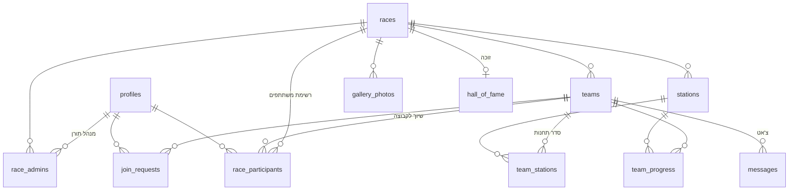

# 03 — מודל נתונים

## 1. תרשים קשרים



## 2. טבלאות

### `profiles` — משתמשים
נוצר אוטומטית בהתחברות ראשונה — דרך Google **או** הרשמה עם טלפון+סיסמה.

| שדה | סוג | הערות |
|---|---|---|
| id | uuid PK | = auth.users.id |
| full_name | text | מ-Google או משדה החובה בהרשמה; ניתן לעריכה |
| avatar_url | text | מ-Google אם יש |
| phone | text unique nullable | מזהה התחברות בהרשמה עם טלפון (E.164) |
| is_owner | bool | מנהל-על |

### `races` — מירוצים

| שדה | סוג | הערות |
|---|---|---|
| id | uuid PK | |
| year | int | ייחודי |
| name | text | "המירוץ למיליון 2026" |
| starts_at | timestamptz | לספירה לאחור |
| game_code | text unique | קוד משחק בסגנון Kahoot |
| status | enum | `draft` / `open` / `live` / `finished` / `archived` |
| start_lat, start_lng | float | בית סבא — זינוק וסיום |
| show_distance | bool default true | האם להציג למשתתפים מד מרחק לתחנה (הגדרת מנהל תורן) |

### `race_admins` — מנהלים תורנים
`(race_id, user_id)` — הרשאת ניהול פר-מירוץ. הבסיס לכל מדיניות ה-RLS.

### `teams` — קבוצות

| שדה | סוג | הערות |
|---|---|---|
| id | uuid PK | |
| race_id | uuid FK | |
| name | text | ניתן לעריכה |
| color | text | צבע מייצג (hex) |
| animal | text | חיה מייצגת + אימוג'י ("🐬 דולפינים") |
| join_code | text | ספרה-שתיים, ייחודי בתוך המירוץ |

### `race_participants` — משתתפי המירוץ
רשימת המשתתפים ברמת המירוץ. תומכת גם ברשומים (בחירה מרשימת משתמשי האתר)
וגם בידניים (ילדים קטנים / בלי חשבון). השיוך לקבוצה הוא עדכון `team_id` —
כולל עדכון קבוצתי לכמה מסומנים בבת אחת (בחירה מרובה):

| שדה | סוג | הערות |
|---|---|---|
| id | uuid PK | |
| race_id | uuid FK | |
| user_id | uuid FK **nullable** | null = משתתף ידני; אחרת הפניה למשתמש רשום |
| display_name | text | שם להצגה (נגזר מהפרופיל לרשומים, חובה לידניים) |
| team_id | uuid FK **nullable** | null = ברשימה אך עדיין לא שויך לקבוצה |

### `join_requests` — בקשות הצטרפות

| שדה | סוג | הערות |
|---|---|---|
| race_id, team_id, user_id | FK | |
| status | enum | `pending` / `approved` / `rejected` |
| decided_by, decided_at | | מי מהמנהלים אישר |

אישור בקשה ⇐ יצירת/עדכון שורת `race_participants` עם ה-`team_id` המבוקש.

### `stations` — תחנות (קטעי מירוץ)

| שדה | סוג | הערות |
|---|---|---|
| id | uuid PK | |
| race_id | uuid FK | |
| name | text | |
| backstory | text | הסיפור/המשמעות של המקום למשפחה |
| clue | text/jsonb | הרמז שמוביל לתחנה (מוצג לפני הגעה) |
| task_content | jsonb | המשימה עצמה (טקסט + מדיה), נפתחת רק בהגעה |
| lat, lng | float | מיקום התחנה |
| radius_m | int | רדיוס נעילה, ברירת מחדל 75 |
| completion_type | enum | `admin_approve` / `secret_code` / `photo_upload` / `auto` |
| secret_code | text | אם רלוונטי |

### `team_stations` — סדר תחנות לקבוצה
`(team_id, station_id, position)` — מאפשר סדר זהה, אקראי, או ידני שונה לכל קבוצה.

### `team_progress` — התקדמות

| שדה | סוג | הערות |
|---|---|---|
| team_id, station_id | FK | |
| arrived_at | timestamptz | אימות מרחק בצד שרת |
| completed_at | timestamptz | הבסיס ללידרבורד |
| approved_by | uuid | אם `admin_approve` |
| proof_url | text | אם `photo_upload` |

**המשימה הנוכחית** של קבוצה = התחנה בעלת ה-`position` הנמוך ביותר ללא `completed_at`.

### `messages` — צ'אט קבוצתי

| שדה | סוג | הערות |
|---|---|---|
| id, team_id, sender_id | | המנהל התורן יכול לשלוח לכל קבוצה במירוץ שלו |
| body | text | |
| attachment_url, attachment_type | text | קבצים מכל סוג (Storage) |
| created_at | timestamptz | |

### תוכן משפחתי

- **`quotes`** — משפטים של סבא וסבתא: `text`, `who` (סבא/סבתא), `image_url` (תמונה/קריקטורה)
- **`gallery_photos`** — גלריה: `race_id`, `url`, `caption`, `uploaded_by`
- **`hall_of_fame`** — היכל התהילה: `year`, `race_id?`, `team_name`, `team_color`,
  `members` (jsonb), `photo_url` — כולל הזנה ידנית של 20 שנות היסטוריה שקדמו לאפליקציה

## 3. מדיניות RLS — עקרונות

```sql
-- דוגמה: עריכת תחנות רק ע"י מנהל תורן של המירוץ, ורק כשהוא לא בארכיון
create policy stations_write on stations
for all using (
  exists (
    select 1 from race_admins ra
    join races r on r.id = ra.race_id
    where ra.race_id = stations.race_id
      and ra.user_id = auth.uid()
      and r.status <> 'archived'
  )
);
```

- **קריאה:** קבוצות והרכבן — פתוח לכל משתמש מחובר (דרישה: כולם רואים את כל הקבוצות);
  `task_content` של תחנה — רק לחברי קבוצה שהגיעו אליה, ולמנהלים
- **צ'אט:** קריאה/כתיבה רק לחברי קבוצה מאושרים + מנהלי המירוץ
- **לידרבורד:** view ציבורי שמחזיר דירוג בלבד, בלי מספרי משימות
