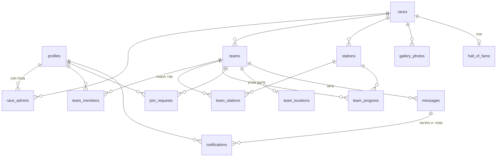

# 03 — מודל נתונים

## 1. תרשים קשרים



## 2. טבלאות

### `profiles` — משתמשים
נוצר אוטומטית מהתחברות Google.

| שדה | סוג | הערות |
|---|---|---|
| id | uuid PK | = auth.users.id |
| full_name, avatar_url | text | מ-Google, ניתן לעריכה |
| birth_year | int | רישום בלבד (החלוקה המאוזנת בוטלה — 02 §3.6) |
| is_owner | bool | מנהל-על |

### `races` — מירוצים

| שדה | סוג | הערות |
|---|---|---|
| id | uuid PK | |
| year | int | ייחודי |
| name | text | "המירוץ למיליון 2026" |
| starts_at | timestamptz | לספירה לאחור |
| game_code | text unique | קוד משחק בסגנון Kahoot |
| status | enum | `draft` / `open` / `live` / `finished` / `archived` |
| start_lat, start_lng | float | בית סבא — זינוק וסיום |

### `race_admins` — מנהלים תורנים
`(race_id, user_id)` — הרשאת ניהול פר-מירוץ. הבסיס לכל מדיניות ה-RLS.

### `teams` — קבוצות

| שדה | סוג | הערות |
|---|---|---|
| id | uuid PK | |
| race_id | uuid FK | |
| name | text | ניתן לעריכה |
| color | text | צבע מייצג (hex) |
| animal | text | חיה מייצגת + אימוג'י ("🐬 דולפינים") |
| join_code | text | ספרה-שתיים, ייחודי בתוך המירוץ |

### `team_members` — חברי קבוצה
תומך גם במשתתפים רשומים וגם בידניים (ילדים קטנים):

| שדה | סוג | הערות |
|---|---|---|
| team_id | uuid FK | |
| user_id | uuid FK **nullable** | null = משתתף ידני |
| display_name | text | שם להצגה (חובה לידניים) |
| birth_year | int | רישום בלבד (החלוקה המאוזנת בוטלה — 02 §3.6) |
| ability | int 1–5 | נותר מהחלוקה המאוזנת שבוטלה; לא נאסף בשום מסך |

### `join_requests` — בקשות הצטרפות

| שדה | סוג | הערות |
|---|---|---|
| race_id, team_id, user_id | FK | |
| status | enum | `pending` / `approved` / `rejected` |
| decided_by, decided_at | | מי מהמנהלים אישר |

אישור בקשה ⇐ יצירת שורת `team_members`.

### `stations` — תחנות (קטעי מירוץ)

| שדה | סוג | הערות |
|---|---|---|
| id | uuid PK | |
| race_id | uuid FK | |
| name | text | |
| backstory | text | הסיפור/המשמעות של המקום למשפחה |
| clue | text/jsonb | הרמז שמוביל לתחנה (מוצג לפני הגעה) |
| task_content | jsonb | המשימה עצמה, נפתחת רק בהגעה: `{"text": "…", "media": "URL או null"}` |
| lat, lng | float | מיקום התחנה |
| radius_m | int | רדיוס נעילה, ברירת מחדל 75 |
| completion_type | enum | `admin_approve` / `secret_code` / `photo_upload` / `auto` |
| secret_code | text | אם רלוונטי |

### `team_stations` — סדר תחנות לקבוצה
`(team_id, station_id, position)` — מאפשר סדר זהה, אקראי, או ידני שונה לכל קבוצה.

### `team_progress` — התקדמות

| שדה | סוג | הערות |
|---|---|---|
| team_id, station_id | FK | |
| arrived_at | timestamptz | אימות מרחק בצד שרת |
| completed_at | timestamptz | הבסיס ללידרבורד |
| approved_by | uuid | אם `admin_approve` |
| proof_url | text | אם `photo_upload` |

**המשימה הנוכחית** של קבוצה = התחנה בעלת ה-`position` הנמוך ביותר ללא `completed_at`.

### `team_locations` — המיקום האחרון של הקבוצה

שורה אחת לקבוצה (PK = `team_id`), נדרסת בכל דיווח. לתצוגה במפת המנהל
בלבד — **לא** מקור להחלטת "הגעתם" (ראו [02](02-architecture.md) §3.9).

| שדה | סוג | הערות |
|---|---|---|
| team_id | uuid PK FK | |
| lat, lng | float | מה שהמכשיר דיווח |
| accuracy_m | float | דיוק המדידה כפי שהדפדפן מסר |
| reported_by | uuid FK | מי מהקבוצה דיווח אחרון |
| updated_at | timestamptz | נקבע בשרת; המפה מדהה מיקום ישן מ-10 דק' |

קריאה: מנהל תורן של המירוץ בלבד. כתיבה: רק דרך `report_team_location`.

### `messages` — צ'אט קבוצתי

| שדה | סוג | הערות |
|---|---|---|
| id, team_id, sender_id | | המנהל התורן יכול לשלוח לכל קבוצה במירוץ שלו |
| body | text | |
| attachment_url, attachment_type | text | קבצים מכל סוג (Storage) |
| mentioned_user_ids | uuid[] | מי אוזכר ב-@ (חברי קבוצה רשומים / מנהלי המירוץ) |
| created_at | timestamptz | |

### `notifications` — התראות In-App

נוצרות ע"י **טריגר DB** על INSERT ל-`messages` (שורה לכל מאוזכר),
כדי שהיצירה תהיה בצד השרת ולא ניתנת לזיוף. הטריגר מסנן את
`mentioned_user_ids` למי שבאמת בצ'אט הזה (חבר קבוצה או מנהל תורן של
המירוץ), אחרת אפשר היה לשלוח התראה לכל משתמש במערכת בקריאת API ישירה.
מבנה גנרי — מוכן גם לסוגי התראות עתידיים (אישור משימה, הודעת מנהל רוחבית):

| שדה | סוג | הערות |
|---|---|---|
| id | uuid PK | |
| user_id | uuid FK | הנמען — הבסיס לסינון Realtime ול-RLS |
| type | enum | `mention` (בהמשך: `task_approved`, `admin_broadcast`...) |
| race_id, team_id | uuid FK | להקשר וניווט |
| message_id | uuid FK | ההודעה המאזכרת — לחיצה מנווטת אליה בצ'אט |
| read_at | timestamptz nullable | null = לא נקראה ⇐ באדג' `@` דולק |
| created_at | timestamptz | |

### תוכן משפחתי

- **`quotes`** — משפטים של סבא וסבתא: `text`, `who` (סבא/סבתא), `image_url` (תמונה/קריקטורה)
- **`gallery_photos`** — גלריה: `race_id`, `url`, `caption`, `uploaded_by`
- **`hall_of_fame`** — היכל התהילה: `year`, `race_id?`, `team_name`, `team_color`,
  `members` (jsonb), `photo_url` — כולל הזנה ידנית של 20 שנות היסטוריה שקדמו לאפליקציה
- **`family_members`** — העץ המשפחתי: `name`, `gender`, `birth_year`, `phone`,
  `photo_url`, `father_id`, `mother_id`, `partner_id`, `profile_id?` (קישור "זה אני"),
  `is_root`, `sort_order` — פירוט מלא ב-[06 — העץ המשפחתי](06-family-tree.md)

## 3. מדיניות RLS — עקרונות

```sql
-- דוגמה: עריכת תחנות רק ע"י מנהל תורן של המירוץ, ורק כשהוא לא בארכיון
create policy stations_write on stations
for all using (
  exists (
    select 1 from race_admins ra
    join races r on r.id = ra.race_id
    where ra.race_id = stations.race_id
      and ra.user_id = auth.uid()
      and r.status <> 'archived'
  )
);
```

- **קריאה:** קבוצות והרכבן — פתוח לכל משתמש מחובר (דרישה: כולם רואים את כל הקבוצות);
  `task_content` של תחנה — רק לחברי קבוצה שהגיעו אליה, ולמנהלים
- **צ'אט:** קריאה/כתיבה רק לחברי קבוצה מאושרים + מנהלי המירוץ
- **התראות:** משתמש קורא ומעדכן (`read_at`) רק שורות שבהן `user_id = auth.uid()`;
  INSERT רק דרך הטריגר (אין הרשאת כתיבה ישירה מהקליינט)
- **לידרבורד:** view ציבורי שמחזיר דירוג בלבד, בלי מספרי משימות
